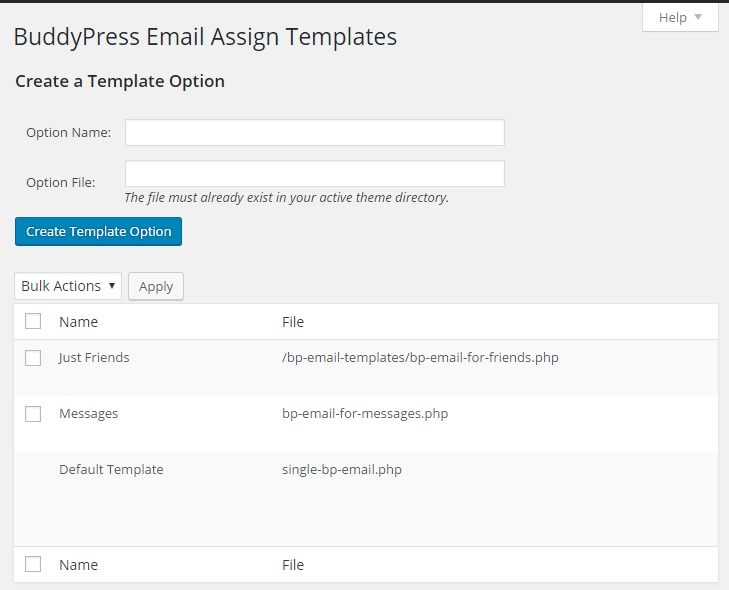
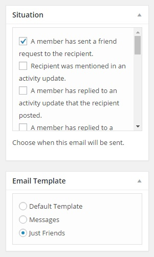

# BP-Email-Assign-Templates

Version 1.3

This BuddyPress plugin allows site administrators to assign template options to individual BuddyPress Emails

The screen located at Emails > Templates

Metabox that will appear on Email create and edit screens

For more info, visit: http://www.philopress.com/products/bp-email-assign-templates/

